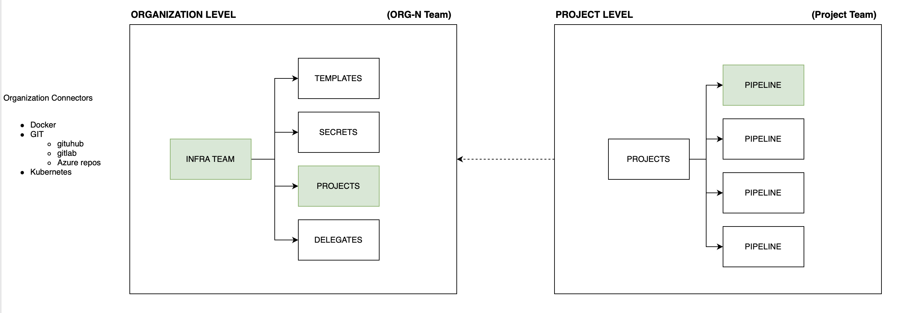

# Harness Account provisioning with Terraform

This repo contains all the necessary to provision and onboard a new Harness Organization and will create the following architecture



### **Directory**

Implementation code is organized with the following structure

```bash
.
├── contrib
│   ├── docker
│   │   └── devcontainer.Dockerfile
│   ├── fixtures
│   │   └── harness-tf.jpg
├── harness-provision
│   ├── main.tf
│   ├── provider.tf
│   ├── templates
│   │   ├── inputsets
│   │   └── pipelines
│   └── variables.tf
└── tfvars
    └── development
        ├── organization.tfvars
        ├── connectors.tfvars
        ├── delegates.tfvars
        └── pipelines.tfvars

```